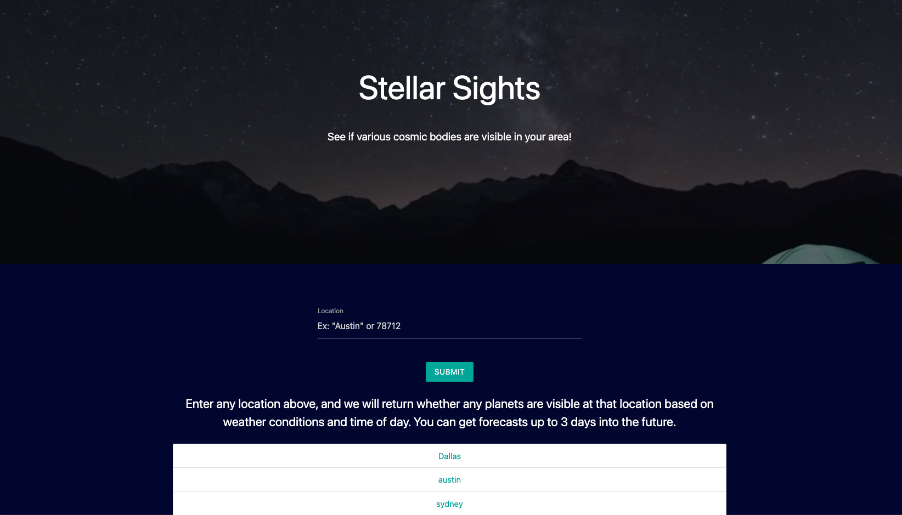
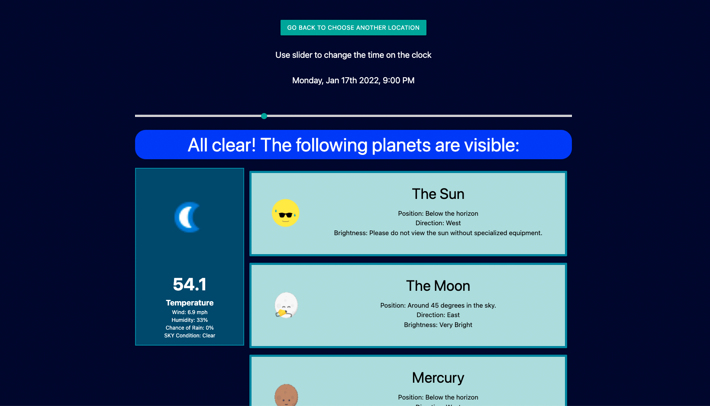

# Stellar Sights
Developers: Martha Dempsey, Romeo Dixon, Sydney Mercier, Maribel Montes, Steven Schmidt

For: UT Austin Coding Bootcamp

Deployed: https://sygmo.github.io/stellar-sights/

## Overview

This app is used to determine if celestial bodies are visible in the night sky based on the weather conditions at a location. The user inputs a location into the search bar and then is redirected to a results page (search history is saved and displayed under the search bar). The results page displays weather conditions, the visible planets, and a slider to change the current time. The cards for each planet show where that planet is relative to the horizon, which direction it is in the sky, and how bright it is. 

## Development

This project utilizes multiple APIs - [Astronomy API](https://astronomyapi.com/), [MapBox](https://mapbox.com/), and [Weather API](https://www.weatherapi.com/). MapBox was used to implement the location search, Astronomy API to get planet positions, and Weather API to get current and future weather conditions. [Materialize](https://materializecss.com/) was used for most styling. 
